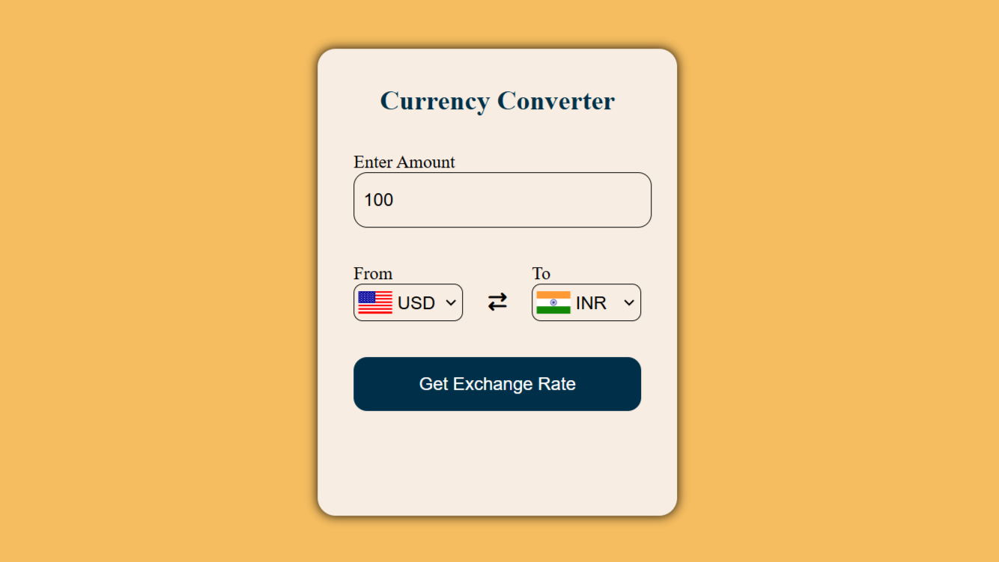

Absolutely! Here’s a more visually attractive version of your README.md with emoji, badges, and symbols to make it stand out on GitHub. I’ve added tech badges, live demo, and decorative symbols:

# 💱 Currency Converter App 🌍



A **simple, interactive, and real-time currency converter** built using **HTML, CSS, and JavaScript**. Convert between **multiple world currencies** instantly with up-to-date exchange rates! 💸

---

## 🚀 Live Demo 🎯

Check it out here: [BharathPadavu/currency-converter-app](https://BharathPadavu.github.io/currency-converter-app/) 🌐

---

## 🛠 Features ✨

- 🌎 Convert currencies between **any two countries**  
- 💹 Fetches **real-time conversion rates** using an API  
- 🏳️ Displays the **country flag** next to the selected currency  
- 🔢 Automatic handling of **invalid or empty input values**  
- ⚡ **Fast and lightweight** – no frameworks required  

---

## 💻 Technical Details 🧩

**DOM Manipulation:**  
- 🖱️ Dynamically generates **currency dropdown options** from `codes.js` (`countryList`)  
- 🏴 Updates the **flag images** when the currency selection changes  
- 📊 Displays the **converted amount** in a styled message box (`.msg`)  
- 🎯 Handles **default values**: `USD` → "From", `INR` → "To"  
- ✅ Validates input amount, defaulting to `1` if empty or invalid  

**API 🌐:**  
- Fetches **real-time conversion rates** using a public endpoint  
- Example endpoint: https://api.budjet.org/fiat/USD/INR
- Extracts `conversion_rate` from the JSON response to calculate the converted amount 💰    

**Event Handling ⚡:**  
- 🔄 Listens for `change` events on dropdowns → **update country flag**  
- 🖱️ Listens for `click` on **Get Exchange Rate** button to:  
- ⛔ Prevent default form submission  
- 📝 Validate input amount  
- 🌐 Fetch conversion rates from API  
- 📈 Display converted amount dynamically  

---

## ⚠️ Limitations ❗

- 🕒 Conversion rates may **update once per day**, depending on the API  
- ❌ Requires **internet connection** to fetch conversion rates  
- 🔒 Free API may have **rate limits** for frequent requests  

---

## 🛠 Installation 🏗️

1. Clone this repository:

```bash
git clone https://github.com/BharathPadavu/currency-converter-app.git

2. Open index.html in your browser


3. Enter the amount and select from/to currencies


4. Click Get Exchange Rate to see results instantly ✅


---

🔧 Usage 🖱️

Default from currency: USD

Default to currency: INR

Flags update automatically with selection 🏴

Defaults to 1 if input is empty 🔢


---

📦 File Structure 📁

currency-converter-app/
├── index.html
├── style.css
├── app.js
├── codes.js
├── screenshot.png
└── README.md


---

🤝 Contributing 💡

Feel free to fork the repository and submit PRs to improve:

🎨 UI/UX design

➕ Adding more currencies

⚙️ Handling API errors gracefully


---

📌 Author 👨‍💻

Bharath Padavu

GitHub: @BharathPadavu

Project: currency-converter-app


---

✨ Enjoy converting world currencies instantly! 💸🌏✨

---


